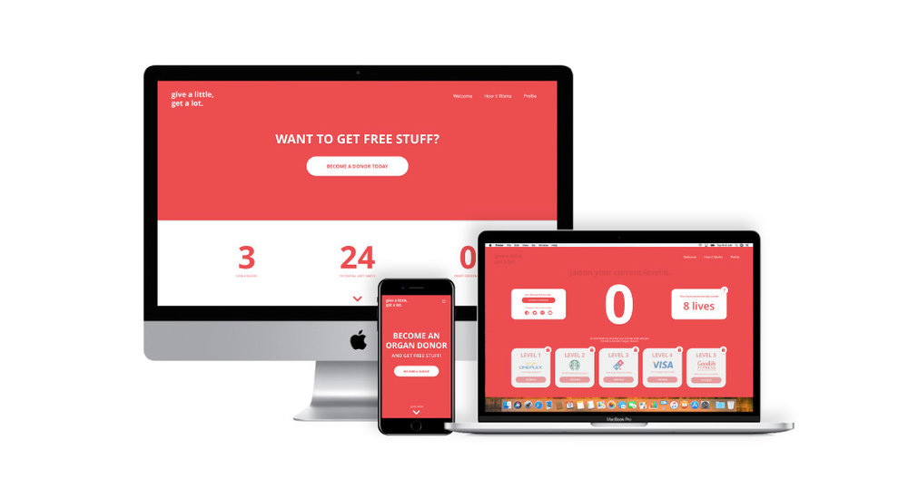

Fanshawe College partnered with Lashbrook Marketing and Public Relations for a semester-long project in my 4th year. The task was simple: create a campaign centered around a website that would encourage Canadians to sign up as organ donors. My group chose to focus our efforts towards young Canadians, around 16 years old, who would soon have the decision to register as an organ donor. We created a website that offered new registered donors unique rewards for signing up as well as encouraging them to recommend others to sign up. The site would have coupons and gift vouchers for the newly registered donars to redeem from partner brands and businesses.

##### Check out this explainer video we made:

`youtube: https://www.youtube.com/embed/1hXaTpTb3vY`

### How we built it:

Using a PHP backend connected to a mySQL database, we had seperate secure login/signup portals for businesses and employees. The account set up had unique inputs that wrote to the database and would be tagged and catagorized for later use. On the businesses account, posting jobs had another set of inputs that would write to the database, creating a reusable job posting. The information provided was searchable and catagorized based on job responsibilities, salary, experience level, and more. The employee has access to a search field as well as selectors to limit searches by specific job details.