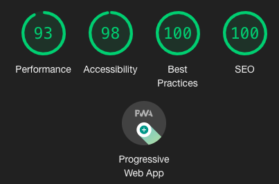

View the live site on [rmdholistics.com](https://rmdholistics.com)

This site is meant to attract potential clients and existing customers to the services offered. The blog is used to post updates and stories that keep users coming back for more content!

Using NuxtJS has drastically improved the overall site speed and page-to-page loading speed. With Google Page Speed Insights I am consistently getting above 90 on mobile speeds and above 95 on desktop speeds.

NuxtJS also provides built-in SEO improvements, accessibility features, and so much more!

I styled the pages using Tailwind CSS and PostCSS. I am using Netlify to host the site as a static site to maximize the speed and development workflow as well as Netlify CMS to provide publishing tools and an authentication system. Netlify provides one-click setup and super simple web hooks to continually update the site directly through my Github repository!

