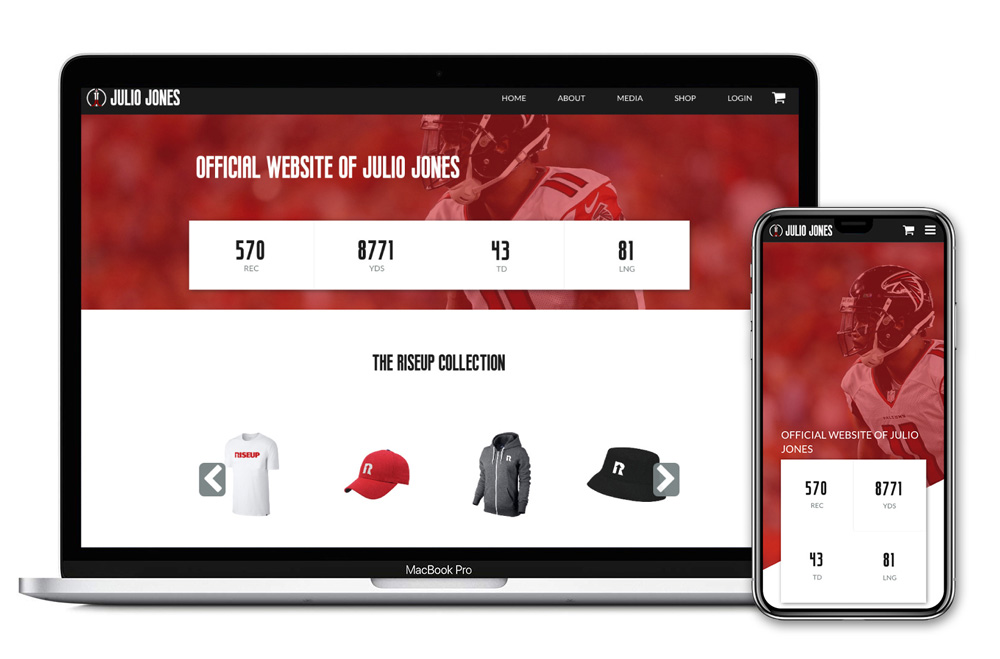

In a group of five, we created a new brand and identity for Julio Jones. We then used the new brand materials and created a fan-centered website all around him both on and off the field. This site was meant to connect Julio's fans directly to him with short blog posts, a live stat tracker, custom merch, and ways to get involved.

To build the live stat tracker, I made an API call out to NFL's statistics collection API. Specifying the player and specific info we wanted to display, we used a JavaScript function to count up from 0 to the current number on-load. We wanted this dynamic feature so that visitors would always see something new on the site. It would keep people coming back to check it out and engage with his personal improvement throughout the season.