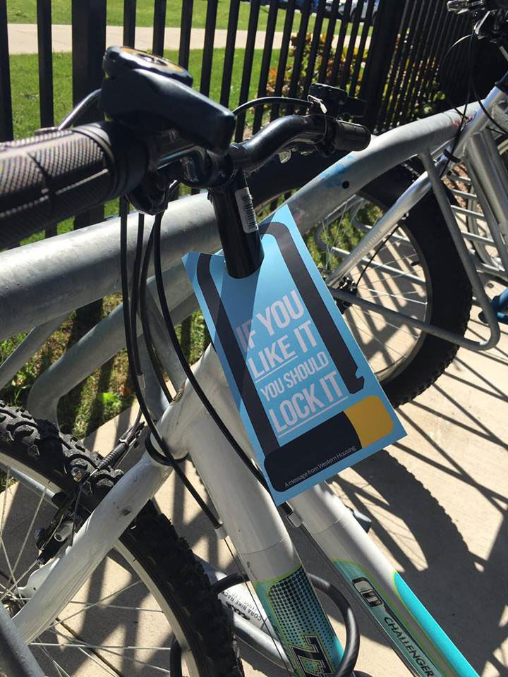
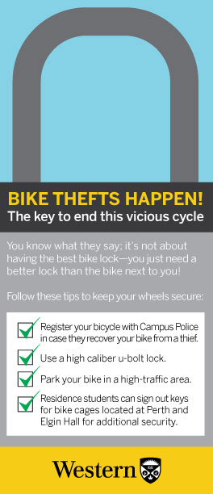

Western University is not immune to the rampant bike thefts happening all over. To help prevent this from happening as frequently on campus, the Housing Department tasked me with creating a unique way to reach out to students. This is a door hanger design meant to hang on a part of a bicycle just like a bike lock would. I spread these out all over campus, hanging them on individual bicycles. This way, the information is truly unignorable.

I won the [Virtuoso Award of Merit for Safety Communication](https://www.virtuosoawards.com/2017-winners/) for the project!

### Print Assets:

With a steady rise in on-campus bicycle theft every year, I was tasked by the Housing Department to create an infographic to inform students of the best practices to keep their bike safe and secure. We needed to create something that would not only be informative, but unignorable to the busy students. I came up with the idea to use a door hanger design to mimic a lock to really reaffirm the visual of security as well as to provide every student with the information the would need. The format was a success with thefts decreased by nearly 20% that reporting period!

I enjoyed working on this project!

