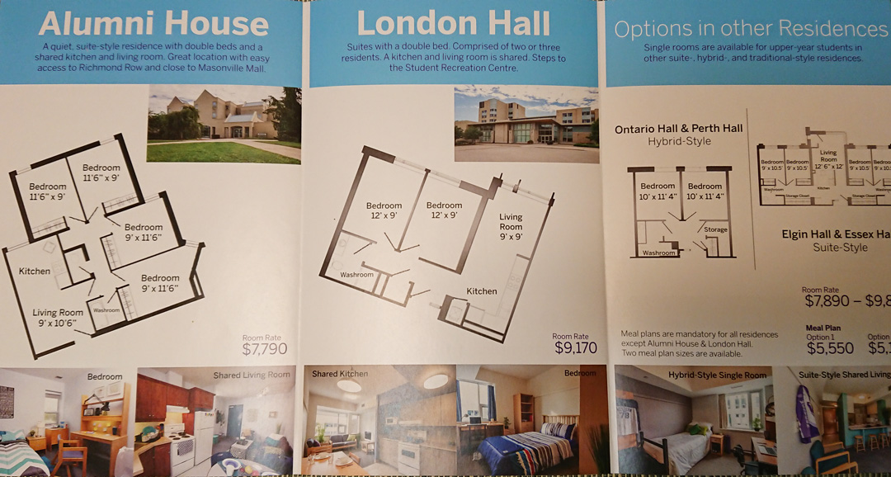

The Western University Housing department oversees the entire student residence experience for first year students as well as upper year students. In a marketing push to encourage students to _live on_ campus after first year, I created this explainer infographic video to showcase all the benefits of on-campus life. This video was one piece of a larger campaign including bus shelter ads, billboards, and social media messaging. 

##### Check out the video:

`youtube: https://www.youtube.com/embed/Wu3hAa-zpew`

### How I made it:

After creating hand-drawn storyboards, I then used Adobe Illustrator to turn that into custom elements for the video. I had to create the part and pieces seperately to ensure motion would look realistic and natural. Using Adobe After Effects, I animated the elements together into the video you see above! We hired a voice actor to read the narration. I rendered the file out using Adobe Media Encoder to ensure low compression and high quality video ready to be shared through email, social media, and on our website!

### Print Assets:

In order to engage with the student population on campus, I created a series of billboards, bus shelter posters, targeted FaceBook and Twitter ads, and email promtions with a consistent visual design and message; overhead photos of student groups and the tagline _lives on_. I created several unique designs for all these mediums in order to reach as many individuals on and around the Western campus.

[View the brochure I created](https://residence.uwo.ca/pdf/living_learning_communities.pdf) about the communities in residence.

