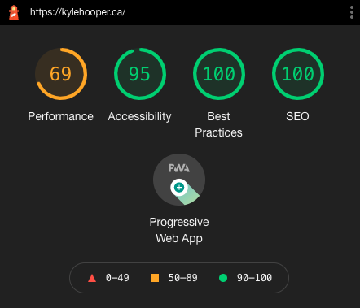

View the live site here: [kylehooper.ca](https://www.kylehooper.ca/)

I created this blog site for Kyle Hooper as a portfolio piece as well as a resume. Using NuxtJS and Netlify CMS, I created a fast loading website with a full-featured CMS for the client to update the site on their own! I decided to start this project with NuxtJS to learn more about VueJS as well as to compare the development process and performance with GatsbyJS.

I styled the page using Tailwind CSS which has been optimized for Vue projects. I chose Netlify CMS to host the site as a static JAM Stack site in order to maximize the speed and development workflow without the client needing to know any code. The completed site is a quick and snappy site with high-quality images and a simple but full-featured CMS.
