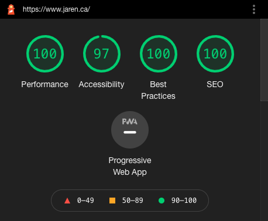
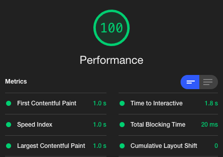

I decided to revamp my portfolio using the GatsbyJS framework to build a super fast static site on the Jamstack. I followed the documentation and a few tutorial videos to create the portfolio from the ground up! For each new project posting, I simply create a new MarkDown file that fills in prebuilt fields on a styled template page.

I styled the page using React Bootstrap which is based on the Bootstrap 4 library. I am using Netlify to host the site as a static site to maximize the speed and development workflow. Netlify provides one-click setup and super simple web hooks to continually update the site directly from my Github repository!

