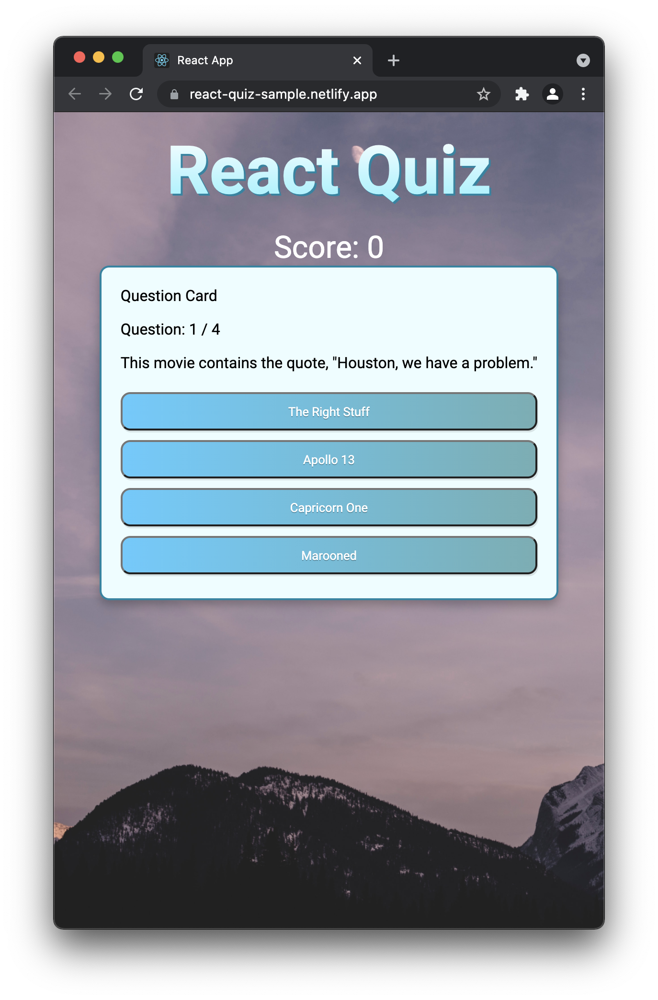

I created a simple ReactJS quiz application bootstrapped using create-react-app. I pulled quiz questions and answer data from the opentdb API available here [opentdb.com](https://opentdb.com) (* I do NOT know what the questions are, I apologize if they seem a bit strange).

Test it out live on Netlify here [react-quiz-sample.netlify.app](https://react-quiz-sample.netlify.app/)

Check out the Github repo to see how I did it [https://github.com/jarenmcdonald1/react-typescript-quiz](https://github.com/jarenmcdonald1/react-typescript-quiz)

