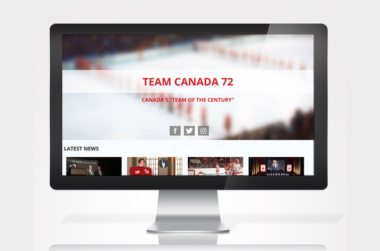
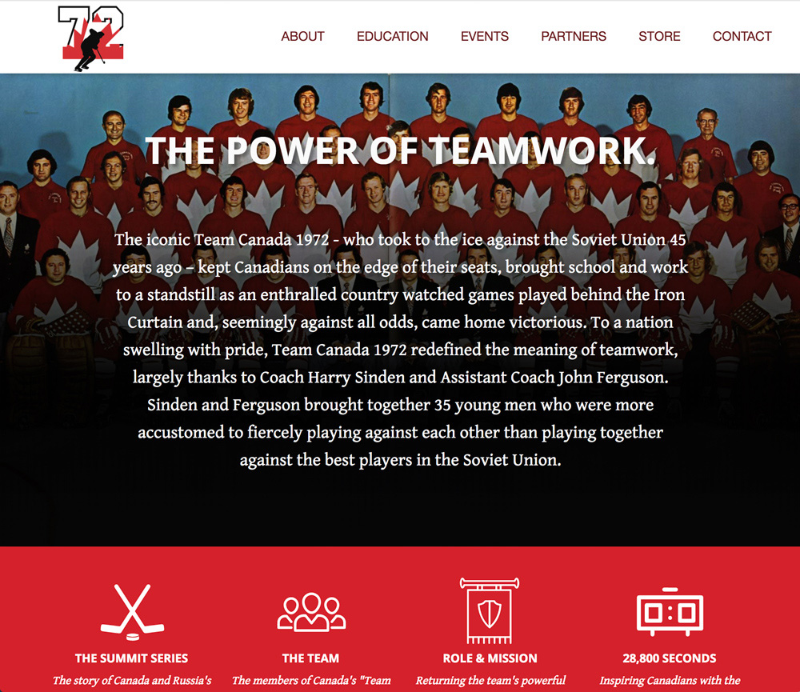
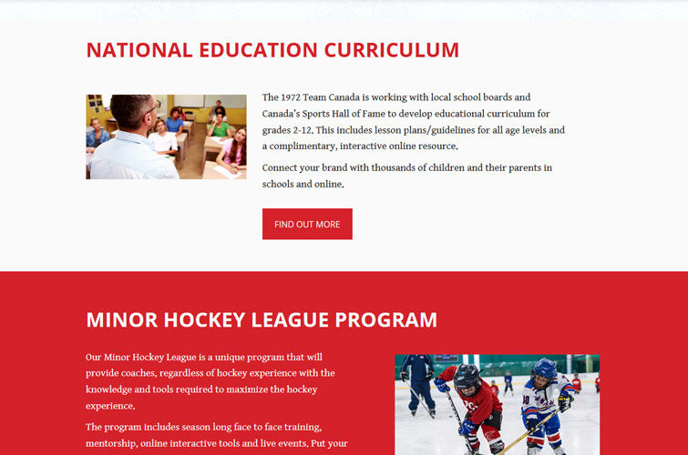

 In my first year at Fanshwe College, the Interactive Media and Design Program partnered with Team Canada 1972 for our year-long project. The goal was to create a digital platform to showcase the team's epic history and bring a renewed interested in the 1972 Summit Series. The project culminated with group presentations at Fanshawe College's annual Industry Night in front of local business leaders where my group's project won the grand prize award and was offered the opportunity to further work with Team Canada 1972!

 

 Our plan was to first hightlight the story and legacy of the 1972 Summit Series, then to showcase current events and programs the team was involved with. By first explaining the history, we wanted to instill interest in the history of the team, then provide ways for the visitor to participate in that legacy.

 

 The website was build with a PHP backend and mySQL database on the LAMP stack.

 