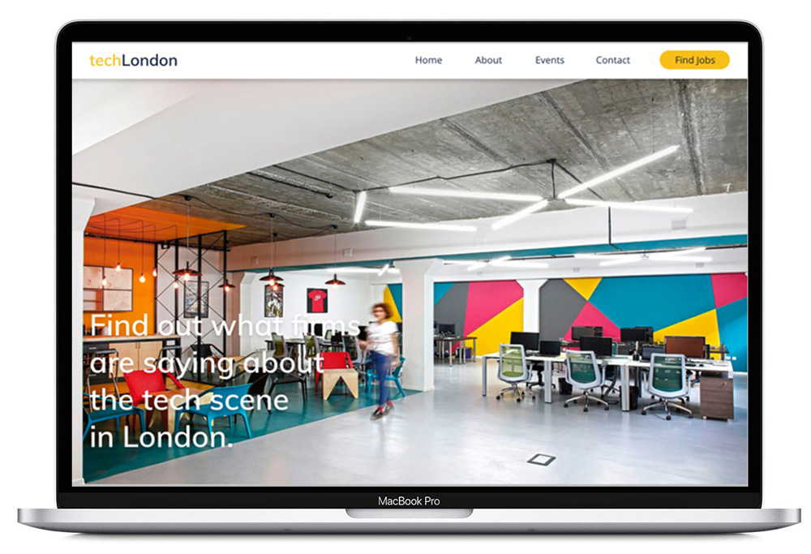
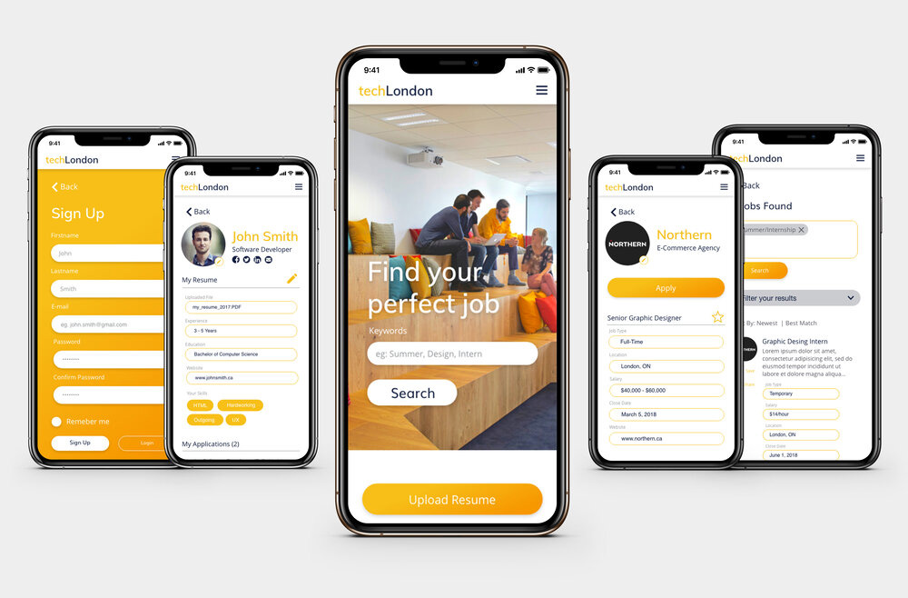
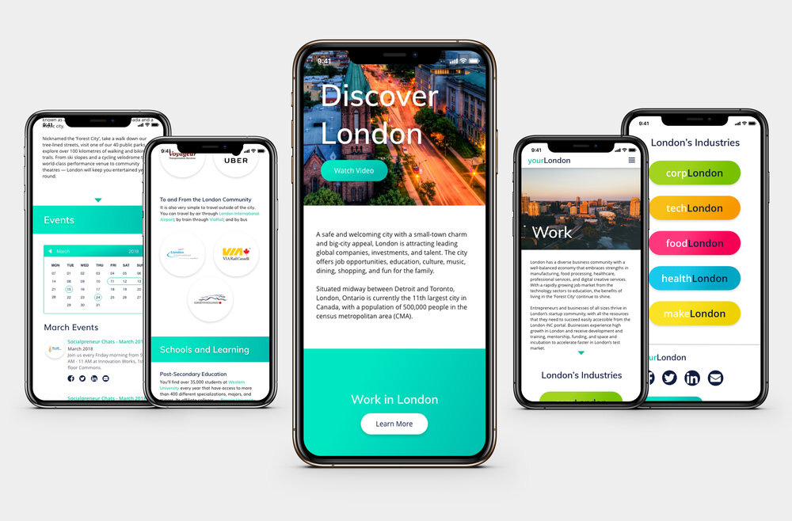

For the cumulative project in my fourth year, Fanshawe College in partnership with the London Economic Development Corporation (LEDC) tasked student groups to create a campaign centered around a website that would encourag students currently studying at Fanshawe College and Western University to stay and work in London, Ontario. Our group created a website that brought employers closer to the talent available in the city; the students! The site would have records of job openings and a profile of the businesses hiring for the students to learn more. **This project placed 1st out of 40+ student groups.**

##### Read more on the [LEDC website](https://www.ledc.com/news/making-a-case-for-real-world-experience)

One of the other initiatives my team came up with was to have a second website dedicated to the advantages of living in London. As students ourselves, we were well aware of the values our target demographic has when choosing a place to start their career. We made sure to include as much information about the city in order to encourage students to consider their future in London.

