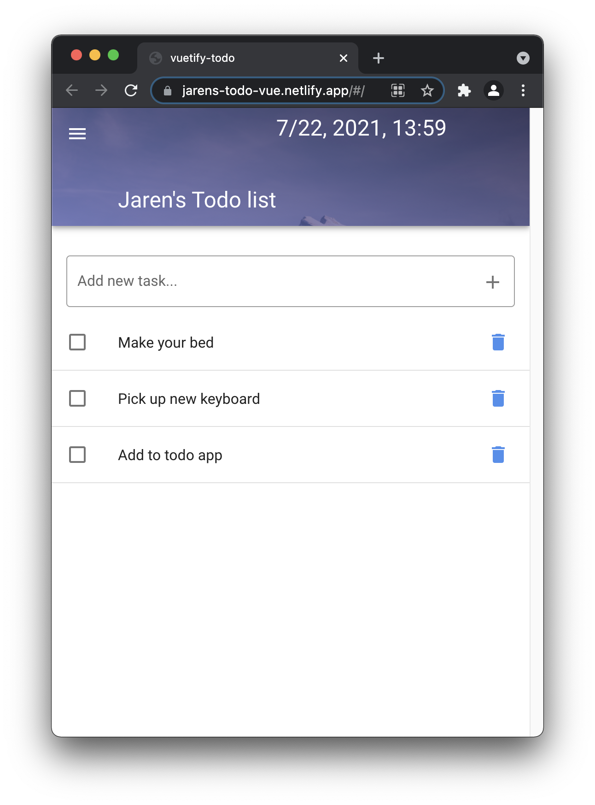

I created a simple VueJS ToDo application to test out Vuetify and VueJS dev tools.

Test it out live on Netlify here [jarens-todo-vue.netlify.app](https://jarens-todo-vue.netlify.app/)

Check out the Github repo to see how I did it [https://github.com/jarenmcdonald1/vuetify-todo-app](https://github.com/jarenmcdonald1/vuetify-todo-app)

